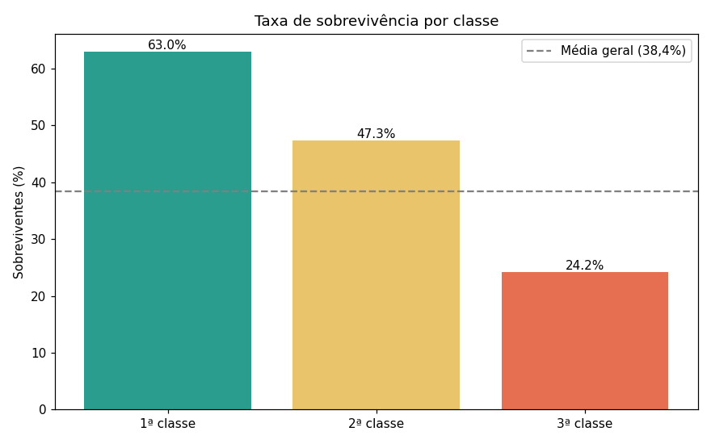
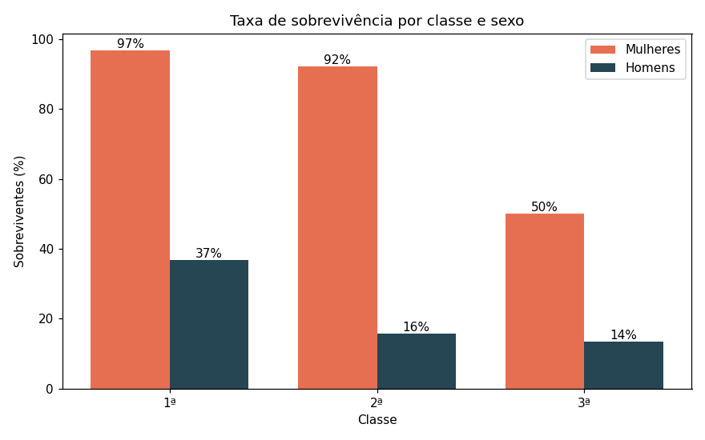
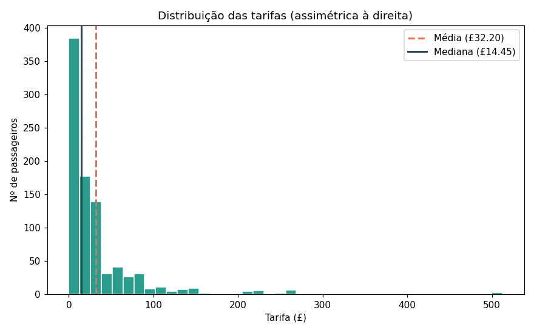

# 🚢 Análise do Titanic — SQL + Estatística em Python Puro

> O Titanic afundou em 1912. Os dados revelam que sobreviver dependeu muito menos da sorte do que do sexo e da classe social — e que a média pode mentir sobre quase tudo.


---

## ⚡ TL;DR

Análise de 891 passageiros com 10 queries SQL + 5 métricas estatísticas implementadas na mão:

- Taxa de sobrevivência geral: **38,4%** — a maioria morreu
- Mulheres sobreviveram a **74%**; homens, a apenas **19%**
- Mulher de 1ª classe: **97%** de chance | Homem de 3ª classe: **14%**
- Uma **mulher da 3ª classe (50%)** tinha mais chance que um **homem da 1ª (37%)** — o sexo pesou mais que a classe
- Tarifa média: **£32,20** — mas a mediana foi **£14,45**. A distribuição é tão assimétrica que a média "mente"

---

## 🎯 Sobre o projeto

Segundo projeto do meu portfólio em transição de carreira para Análise de Dados — desenvolvido na **Semana 2** do roadmap *"Carreira Dados + IA"*.

O objetivo foi praticar, num único projeto de ponta a ponta:

- **SQL aplicado**: modelagem, carga e 10 queries de análise no SQLite (`GROUP BY`, `CASE`, cruzamentos, agregações)
- **Estatística por dentro**: implementar as 5 métricas manualmente, sem `.mean()` ou `.median()` — para entender o que cada fórmula realmente calcula
- **Interpretação**: conectar cada número com o que ele revela sobre os passageiros

> A regra que guiou o projeto: pandas entra apenas para carregar e organizar os dados. Os cálculos estatísticos são todos feitos a mão, função por função.

---

## 🔍 Principais achados

### 1. Sexo foi o fator mais determinante

O protocolo "mulheres e crianças primeiro" aparece nos dados com clareza brutal: **74% das mulheres sobreviveram**, contra **19% dos homens**. Nenhuma outra variável isolada produz uma diferença tão grande.

### 2. A classe veio logo atrás



1ª classe **63%** | 2ª classe **47%** | 3ª classe **24%**. A classe se refletia em tudo: na tarifa (1ª pagava ~6x mais), na localização do camarote (proximidade dos botes), e até no porto de embarque.

### 3. Classe e sexo juntos contam a história completa



Nos extremos: **mulher de 1ª classe (97%)** vs **homem de 3ª classe (14%)**. O achado mais marcante: **mulher da 3ª classe (50%) tinha mais chance que homem da 1ª (37%)**. O sexo pesou mais que a classe — e mais que o dinheiro.

### 4. A média pode enganar — tarifas mostram isso claramente



Tarifa **média: £32,20** | Tarifa **mediana: £14,45** — menos da metade. A distribuição é fortemente assimétrica à direita: a maioria pagou pouco, mas algumas tarifas altíssimas (até £512) puxam a média para cima. Em casos assim, a mediana representa melhor o passageiro típico.

---

## 🧭 O que este projeto ensina sobre análise de dados

1. **Correlação não é causa** — Cherbourg teve a maior taxa de sobrevivência entre os portos, mas só porque concentrava passageiros de 1ª classe. O porto não salvou ninguém.

2. **A média pode mentir** — Em distribuições assimétricas (como renda, tarifas, tempo de resposta), a mediana representa melhor o "típico". A média é sensível a extremos.

3. **Dados faltando têm padrão** — As 177 idades ausentes não eram aleatórias: concentravam-se na 3ª classe. Ignorar isso distorceria qualquer análise por faixa etária.

---

## 🛠️ Stack utilizada

| Ferramenta | Uso |
|---|---|
| **Python 3.14** | Linguagem base |
| **SQLite3** | Banco de dados (módulo nativo) |
| **Pandas** | Apenas para carregar/organizar dados |
| **Matplotlib** | Visualizações |
| **Jupyter** | Notebook interativo |

---

## 📁 Estrutura do repositório

```
analise-titanic-sql-estatistica/
├── README.md
├── requirements.txt
├── data/
│   └── titanic.csv          # dataset (titanic.db é gerado pelo notebook)
├── images/                  # gráficos exportados
└── notebooks/
    └── analise_titanic.ipynb
```

---

## ▶️ Como executar

```bash
# 1. Clone o repositório
git clone https://github.com/RickelmeDSC/analise-titanic-sql-estatistica.git
cd analise-titanic-sql-estatistica

# 2. Instale as dependências
py -m pip install -r requirements.txt

# 3. Abra o notebook
py -m jupyter notebook notebooks/analise_titanic.ipynb
```

> 💡 Rode as células de cima para baixo: o notebook cria o banco `data/titanic.db` a partir do CSV, executa as análises e regenera os gráficos em `images/`.

---

## 🎓 O que aprendi com este projeto

- **SQL:** `GROUP BY` (inclusive por múltiplas colunas), `CASE WHEN`, `ORDER BY`, agregações (`COUNT`, `SUM`, `AVG`, `MIN`, `MAX`), tratamento de `NULL` e cruzamentos de variáveis
- **SQLite3 em Python:** criar conexão, executar queries com `cursor`, fechar conexão corretamente
- **Estatística por dentro:** implementar média, mediana, moda, variância e desvio-padrão sem funções prontas — e entender por que cada fórmula é o que é
- **Assimetria na prática:** ver a diferença entre média e mediana em dados reais, não só em exemplos didáticos
- **Dados faltando não são neutros:** ausências têm padrão e afetam conclusões

---

## 👤 Autor

**Rickelme David** — em transição de carreira para Análise de Dados + IA.

[](https://github.com/RickelmeDSC)
[](https://www.linkedin.com/in/rickelme-david-75630b203/)

---

## 📚 Fonte dos dados

Dataset público do Titanic, disponível no [Kaggle](https://www.kaggle.com/datasets/yasserh/titanic-dataset).